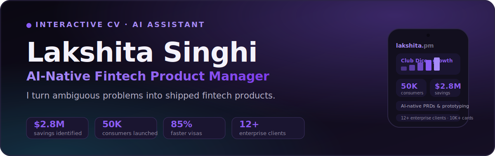

# cv-lakshita

<p align="center">
  
</p>

<p align="center">
  
  
  
  
</p>

**Live: [cv-lakshita.vercel.app](https://cv-lakshita.vercel.app/)**

Interactive CV for **Lakshita Singhi** — AI-Native Fintech Product Manager. A
portfolio that demonstrates the work instead of listing it: case studies with
real product metrics, a pointer-tracked product-dashboard mockup (pure CSS 3D
transforms, no WebGL), a print-perfect
[résumé view](https://cv-lakshita.vercel.app/#resume) (PDF via the print
dialog), and an AI assistant ("Lumi") that answers questions about her
experience in first person.

Inspired by [santifer/cv-santiago](https://github.com/santifer/cv-santiago),
rebuilt and simplified: the entire CV fits in an LLM's context, so there is no
RAG pipeline — knowledge lives in a single system prompt
([api/_lib/system-prompt.ts](api/_lib/system-prompt.ts)).

## Highlights

- **AI assistant "Lumi"** — a floating chat that answers in first person as
  Lakshita, grounded in the real CV data. Provider-agnostic: streams from Groq,
  Gemini or Anthropic, with prompt-injection guardrails.
- **Fintech case studies** — Emirates NBD corporate cards ($2.8M TAM), Club
  Dice consumer growth (50K users), YES Bank digital-banking PaaS, agentic
  corporate travel (85% faster visas) and Pine Labs / JioPay white-label GTM.
- **Product deep-dives** — three 0→1 builds (Mileway, PaymentsLab, Kursi)
  presented through a PM lens: discovery → user stories → product decisions →
  success metrics → GTM, with real screenshots and a device-wall switcher.
- **Print-perfect résumé** at `/#resume` — the same source data, ATS-friendly,
  export to PDF via the browser print dialog.
- **Interaction polish** — pointer-tracked 3D product-dashboard hero (pure CSS,
  no WebGL), ⌘K command palette, scroll-reveal animations and a count-up
  metrics band, all respecting `prefers-reduced-motion`.
- **Single source of truth** — [src/data/profile.ts](src/data/profile.ts)
  drives the page *and* the chatbot's knowledge; the system prompt is
  regenerated from it at build time, so the two can never drift.

## Stack

React 19 · TypeScript · Vite 7 · Tailwind v4 · Vercel Edge Functions ·
**provider-agnostic chat backend** — streams from Groq (Llama 3.3, free tier),
Google Gemini, or Anthropic Claude, whichever key is configured, normalized to
one SSE format so the widget never knows the difference.

## Quick start

```bash
npm install
cp .env.local.example .env.local   # add your GROQ_API_KEY to enable chat
npm run dev
```

Open http://localhost:5173. The site works without a key; the chat widget
shows a contact fallback until one of `GROQ_API_KEY` / `GEMINI_API_KEY` /
`ANTHROPIC_API_KEY` is set (priority: Groq → Gemini → Anthropic). In dev, a
Vite middleware ([vite.config.ts](vite.config.ts)) serves `/api/chat` with the
same handler Vercel runs in production — no `vercel dev` needed.

## Deploy — Vercel (site + chat in one place)

Import the repo at [vercel.com/new](https://vercel.com/new) (Framework preset:
Vite, auto-detected), then add an environment variable **`GROQ_API_KEY`** with
your free key from [console.groq.com/keys](https://console.groq.com/keys) and
click **Deploy**. `api/chat.ts` runs on the Edge runtime and streams the
model's SSE straight through to the widget. Every push to `main` auto-redeploys.

## Structure

```
api/
├── chat.ts                  # Vercel Edge entry
└── _lib/
    ├── chat-handler.ts      # Web-standard handler (shared dev/prod)
    └── system-prompt.ts     # Lumi persona + CV knowledge + guardrails
src/
├── App.tsx                  # All sections (hero, metrics, case studies…)
├── FloatingChat.tsx         # Chat widget — SSE streaming, quick prompts
├── data/profile.ts          # CV content (single source of truth)
└── index.css                # Tailwind v4 theme tokens
```

## Updating content

Edit [src/data/profile.ts](src/data/profile.ts) for the page and
[api/_lib/system-prompt.ts](api/_lib/system-prompt.ts) for the chatbot —
keep the two in sync so Lumi never contradicts the page.
